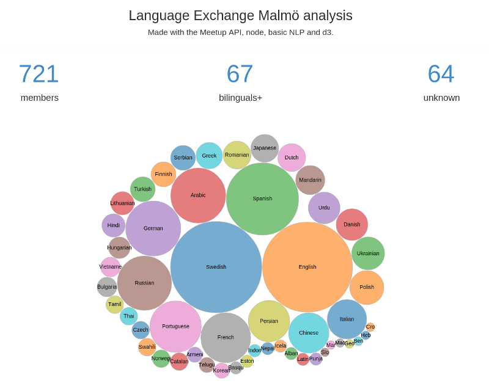

[Meetup](https://meetup.com) is a wonderful platform. It makes it super easy to find groups of people sharing common interests, and it also provides an API!

I have been several times to the [Language Exchange group](https://www.meetup.com/intercambio3) events in Malmö. This is a group bringing people together so they can practice languages. There are events for a lot of languages: swedish, portuguese, spanish and more. And it's always a good opportunity to meet new people from all around the world.

To join this group, some questions must be answered, and one of them is: **What is your mother tongue?**.

To that question, the members usually answer in English with just a few words, like "Swedish" or "I am a native French". Since I want to know what language the members speak nativally and create the language distribution, I focused the analysis on that question.

## Links

- Visualization: https://malmolanguage.jtp.io

The rest of the post focuses **only on some specific parts** of the code, that you can find on github: https://github.com/jtpio/meetup-malmo-language"

## Using the Meetup API

Instead of browsing hundreds of profiles manually, there exists a better tool for that task: the Meetup API. The documentation can be found [here](https://www.meetup.com/meetup_api).

In the code, we define variables for that meetup group, as well as the meetup API key that is placed in an environment variable. Here we use "/2/profiles" as the URL path to retrieve the profile details, since they contain the answers to the question.

```js
var malmo = { question: 2187832, url: "intercambio3" };
var MEETUP_KEY = process.env.MEETUP_KEY;
var QUESTION_ID = malmo.question;

var urlObj = {
  protocol: "https",
  host: "api.meetup.com",
  pathname: "/2/profiles",
  query: {
    group_urlname: malmo.url,
    sign: true,
    key: MEETUP_KEY,
  },
};
```

After getting the response, the answer for the question needs to be filtered and passed to the analyzer. Then if the response contains any cursor (the "next" property), use it to retrieve the next data (apparently Meetup limits the number of results to 200 per page, even though there is no limit set in the request).

```js
results.forEach(function (result) {
  var ans = result.answers.filter(function (ans) {
    return ans.question_id === QUESTION_ID;
  })[0];

  if (ans) {
    analyzer.extractLanguage(ans.answer);
  }
});

if (res.meta.hasOwnProperty("next") && res.meta.next !== "") {
  crawl(res.meta.next);
} else {
  analyzer.printResults();
}
```

## Analyzing the data with the node module Natural

Once the answer is retrieved, the next part is to extract one or several languages from it.

The problem is that some people answer that question using a plain sentence, or mispelling words ... Doing a dictionary lookup against a list of languages is not enough in that situation.

Fortunately, [Natural](https://github.com/NaturalNode/natural) comes as a handy tool, as it makes it possible to tokenize the answer using natural language techniques. The two useful features used for this application are the **tokenization** and the **JaroWinklerDistance distance**.

The first step is to sanitize the data to get a proper array of tokens.

```js
var _ = require("lodash");
var tokens = _.uniq(
  _.map(tokenizer.tokenize(str), function (t) {
    return _normalize(t);
  })
);
```

Then, for each token, increment the counter for that token if the language is found in the dictionary. It means that in this case the token is a language.

```js
var m = 0;
tokens.forEach(function (t) {
  if (dictEN[t]) {
    res[t] = res[t] + 1 || 1;
    m++;
  }
});
```

If the number of matches is 0, it means that we couldn't find any language in that sequence of tokens. Maybe the language has been mispelled? This is where the **JaroWinklerDistance distance** becomes useful. It is used to evaluate how different two strings are. We use it to compare each token to the available language, if there is one token close to a language, we can assume that the member wanted to type that language. The _DISTANCE_THRESHOLD_ constant was arbitrarily chosen after some testing.

```js
if (m === 0) {
  // no match
  tokens.forEach(function (t) {
    for (var lang in dictEN) {
      var dist = natural.JaroWinklerDistance(lang, t);
      if (dist > DISTANCE_THRESHOLD) {
        res[lang] = res[lang] + 1 || 1;
        m++;
        break; // stop for this language
      }
    }
  });
}
```

Finally, we keep track of the sentences giving no answer, as well as the number of people who mentionned more than one language as the mother tongue, just as simple stats.

```js
if (m === 0) {
  unknown.push(str);
} else if (m > 1) {
  bilinguals++;
}
```

## Displaying the data

The visualization is done using **d3**. Please have a look at the source code for more details.



What we can notice is that the number of _unknown_ is still acceptable, 64 / 721 = ~9%, but some of them are correct languages, except that they are written in Swedish ...

## Conclusion

In this post, I presented a way for retrieving and analyzing answers from Meetup profiles. This is of course very dependent on the Meetup group structure and the questions asked to the members. This method can be used for other groups, but will need manual modifications for the question id and group url name.
