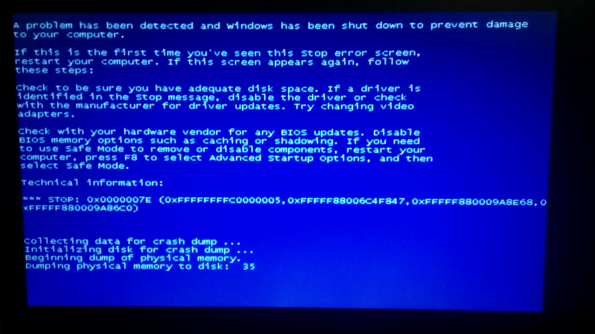

It's this time of the year again! The [Global Game Jam](https://globalgamejam.org/) is happening this weekend everywhere in the world.

For the third time in a row, I will be taking part in this BIG event, and it will be in [Malmö](//www.malmojamstoo.com/ "Malmo Jams Too!"), Sweden.

## Prepare your stuff

The key point to have fun and not fail at a game jam is to come **prepared**.
Being prepared means having all the tools ready before starting the game jam. It is also important to think about the logistics (food, sleep, transport...) to be as comfortable as possible while jamming.

There is a very good **checklist** on the Malmo Jams Too website that you should take a look at:
[malmojamstoo.com/files/GGJ2015_MJT_Checklist.pdf](https://malmojamstoo.com/files/GGJ2015_MJT_Checklist.pdf)

Here is a quick summary of the points I think are the most important for preparation and on-site:

- Check your hardware and make sure your computer can survive a 48-hour jam.
- Check your programs and tools (Game Creation tools, IDEs, Audio, Graphics).
- Balance your team: programmers, artists, sound designers...
- Get a prototype working quickly, start small, and iterate.
- Sleep, at least Friday night.
- Keep a bottle of water/Red Bull and some snacks in case of starvation.
- **Keep it simple**.

## How I prepared for the GGJ

### Booting up the old Windows

It seems easy, but it wasn't that nice. A few seconds after startup, I was stuck with a BSOD right in the face. I hadn't used my Windows session (dual-boot) for more than 2 months, so it's hard to know why it just broke...
Rather than spending hours trying to fix that mess, I decided to reinstall Windows entirely. Since I don't have any Windows CD available, the easiest solution was to install a fresh new copy of the Windows 10 tech preview. The install went well, I managed to install the classic tools, like Unity and Dropbox. Then followed several hours of normal usage, and in the end, everything felt pretty stable.

### Unity warm-up

I haven't used Unity since the last Global Game Jam, so it was a good occasion to do something very small to get familiar again with the environment.
Since I recently got a Google Cardboard, I wanted to know how to get something running on that. The Cardboard seems to be a good support for originality and new game ideas, so let's try a quick experiment on it.

I gave myself two hours to come up with a small demo of "something VR." I ended up doing a quick 3D demo of a snowman jumping on blocks in the sky (inspired by [Eat That Snow](//play.google.com/store/apps/details?id=com.gtomee.eatthatsnow) obviously), that is working pretty well with the cardboard.

<iframe
  class="w-full h-80 aspect-w-16 aspect-h-9 rounded-lg shadow-lg"
  src="https://www.youtube.com/embed/om5FfYizq5Q"
  allowfullscreen
></iframe>

### That's it

Now it's time to rest before the long weekend.

If you are going to jam as well, have fun!
