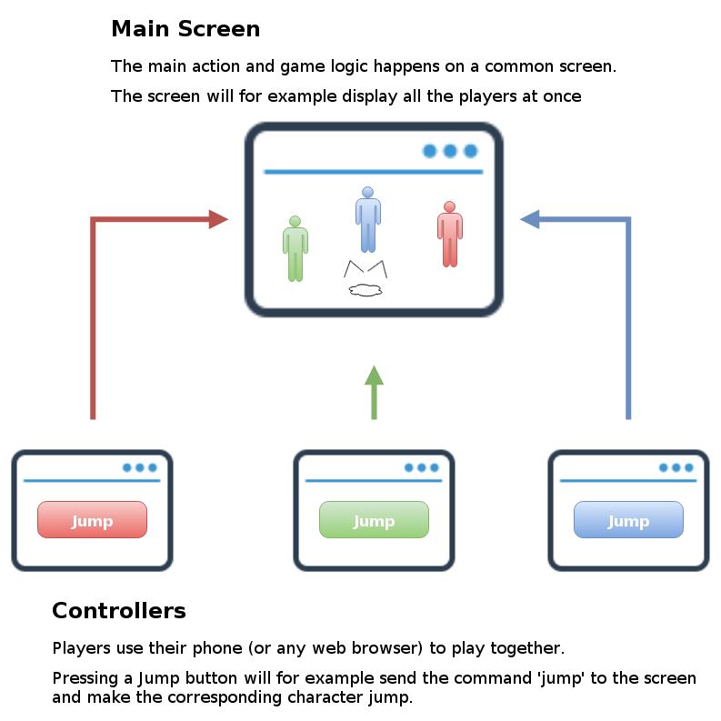
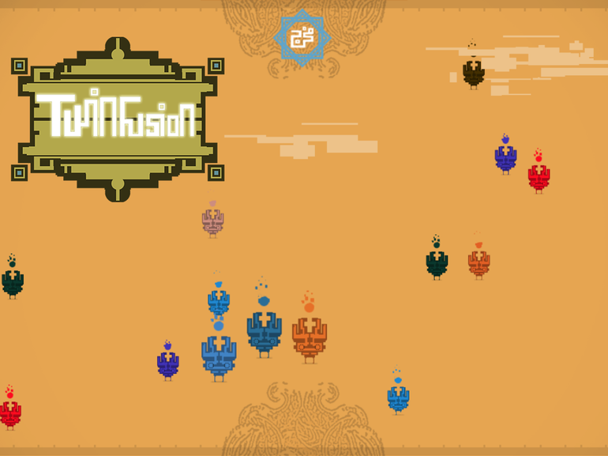
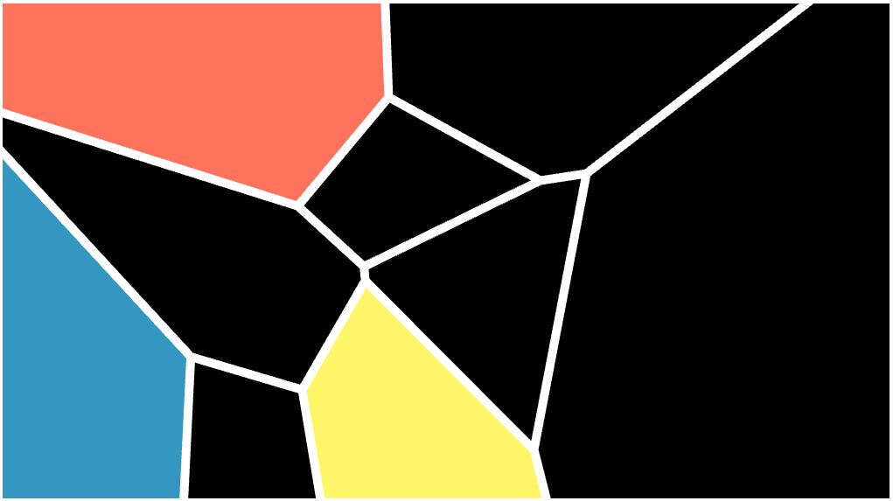
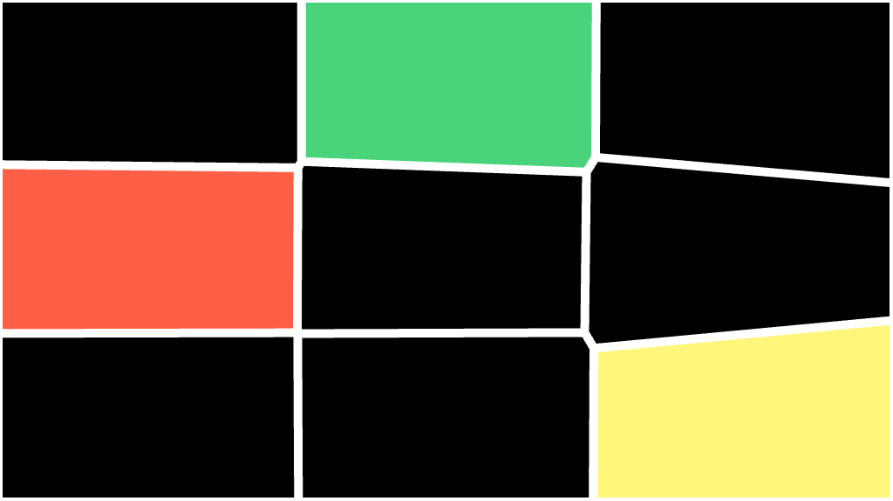

## At a Game Jam

Suppose you go to a game jam and you want to create a multiplayer game. You talk about this idea with other people, and what you hear:

- "Multiplayer games are too difficult to make"
- "You will waste time on technical details and won't be able to focus on the gameplay"
- "You will fail"
- ...

That's right, multiplayer games are hard to implement, especially under time constraints and pressure. It is a **crazy idea** to even consider it at a game jam.

However, the networking part of a game is similar to other aspects like graphics, physics and artificial intelligence. If you come with the right tools and frameworks (a game engine for example), getting started will become easier and will speed up the process of game creation.

This post will give an insight on how to tackle this challenge.

## A web based multiplayer game?

It's **web based**:

- Written in **Javascript**.
- The only thing players need is access to a **web browser**.
- Which makes it relatively **easy** for the player to **get in the game**, jump in and out.

The types of interactions are illustrated below.

The Main Screen also talks to the players to assign a color or update a state for example.

It's always nice when other participants at a game jam want to try your game. But it should be easy to setup, without requiring thousands of steps. Being web based has the big advantage of **improving the accessibility**.

## Prepare the tools

The key point at a game jam is to save as much time as possible. **Knowing the tech and the tools is crucial** to not waste effort on technical details.

- More generally and as a prerequisite, make sure to use a familiar **game engine**. For 2D web based games, my preference goes to [Phaser](https://phaser.io).
- If you want to take the opportunity of the game jam to learn a new engine, spend some days before to at least cover the basics.
- Use a **networking framework** to cover the communication layer. Refer to the [next section](#what-to-use) for suggestions. You can also make your own tech before and bring it in your tool box. Again, come familiar with the framework.

Then at the jam:

- Start by implementing a minimal prototype first. Make sure that the networking part work as intended, by exchanging some dummy messages between the players and the main game. This is especially important if the multiplayer aspect is at the core of the gameplay.
- Iterate and **always keep the game playable**.
- Use a version control system to make it easy to try crazy things and concepts, still being able to revert the changes in case something goes wrong.
- **Latency** might be a problem. When a message is sent from a controller, it will take some time to reach the main screen. If possible, try to build a game where latency is not critical and can be "ignored".

## What networking framework to use? 

### HappyFunTimes

Check it out here: https://github.com/greggman/HappyFunTimes

> HappyFunTimes is a system for playing party games that are meant to be played with a bunch of people in the same room and 1 ideally large display.

I used HappyFunTimes once at a game jam. It helped us (the team) a lot to build what we wanted.

HappyFunTimes is a great and very complete framework. However, we faced two difficulties:

1. We **spent quite some time to understand how everything works**. We wanted to modify the framework just a little bit to fit our needs better, but got lost by the big amount of files. Again, **try the framework out before the jam** to arrive more relaxed.
2. It only worked on a local network. We wanted to share a link to the game after the jam, but it was impossible as everyone would have conflicted with each other (playing on the same instance).

These two points led to the creation of jammer. See below.

### Jammer

Check it out here: https://github.com/jtpio/jammer (with documentation and examples)

Jammer is obviously inspired by HappyFunTimes, but with the following goals in mind:

- It should be possible to **put the game online** and allow many players to connect to different game sessions simultaneously, without interfering with each other.
- Everything should be kept at the **strict minimum**. Only the networking part is supported, but it is easy to interface it with a game engine like Phaser for example.
- Get things done quickly.
- Good choice for small projects like a game jam. Maybe too simple for a bigger project.

#### How it works

1. A server routes messages between players (phones) and the main shared screen. It is actually just a **simple relay**.
2. The main game runs in the shared web browser (main screen), and phones are used as controllers.
3. The system is event-based. Listen to events to take actions.

## Examples

### Twin Fusion

Code: https://github.com/jtpio/twin-fusion

Made at the [Arabic Game Jam 2014](http://arabicgamejam.org/game-concepts-2014/) in Malmö, Twin Fusion was originally implemented on top of **HappyFunTimes**. It was then rewritten with **jammer** to keep things simpler, reduce the code size, and make it possible to play on the Internet.

### Squame

Code: https://github.com/jtpio/squame

Made as a hobby project, a proof of concept to showcase **jammer**, [Squame](https://github.com/jtpio/squame) was first demoed at [DemoDag Copenhagen](https://demodag.org/) as a two-players game (refer to the branch [two-players](https://github.com/jtpio/squame/tree/two-players)).

It was then [remastered](https://github.com/jtpio/squame/tree/master) and demoed at [DemoDag Malmö](https://twitter.com/demodag_malmo), allowing many more players to connect at the same time.

The concept:

- When a participant joins, it controls one area which has its own color.
- On the phone, the player can move the area or swicth to another one.
- The goal is to make everything **straight** and look like a grid (screenshot below).
- Once a level is completed, the game moves to the next one, containing more regions.

Check out the [code](https://github.com/jtpio/squame) to learn more.

It is a good example on how to **build everything together with Phaser, Require.js and jammer**. You can even use that example as a template for your game, and remove everything you don't need.

## That's it

That was some tips, tools and examples, should you want to go for a multiplayer game at a game jam.

It is also possible to use the same tech for something that is not game, a cooperative experiment for example.

Let me know if you have any question!
