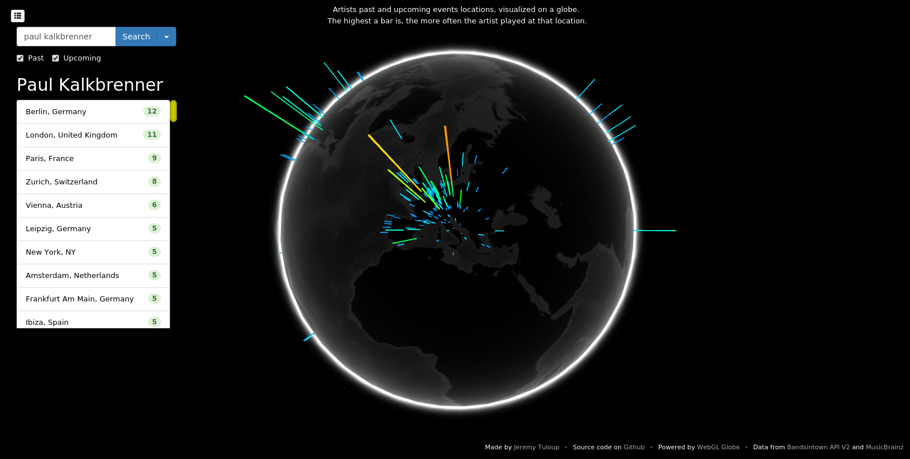
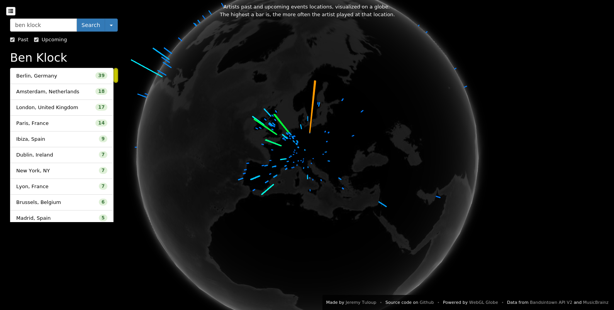

Here is a project called **[Music Globe](//music-globe.jtp.io)**.

Search for an artist, a band or any entity giving concerts and it will show you the locations of where they performed.

This project was made quite some time ago, but I wanted to _log_ it to this blog.

## Context

I needed a tool to have an idea of where my favorite artists play live. The data is for most of them accessible on websites like [Bandsintown](//bandsintown.com) and [SongKick](//songkick.com), but it comes as a list of events sorted by date.

That tool shows the same data but in a more visual way.

Go have a look there! **[music-globe.jtp.io](//music-globe.jtp.io)**

## Showcase

Quick presentation at _Foo Café_ for [Demo Dag Malmö](//twitter.com/demodag_malmo):

<iframe class="w-full h-80 aspect-w-16 aspect-h-9 rounded-lg shadow-lg" src="//www.youtube.com/embed/ZjFKV0fyIgU" allowfullscreen></iframe>

## That's it

That's all I got for today.

I personally use it pretty often to look at the artists I would like to see live one day. It gives a better idea of where they play, which could be useful for planning trips and vacation.

The project is on [Github](//github.com/jtpio/music-globe), check it out for the source code and technical details.

You can also find it on the [Chrome Experiments](//www.chromeexperiments.com/globe) website, in the WebGL Globe section.

Let me know if you like it, and feel free to contribute or give feedback!
