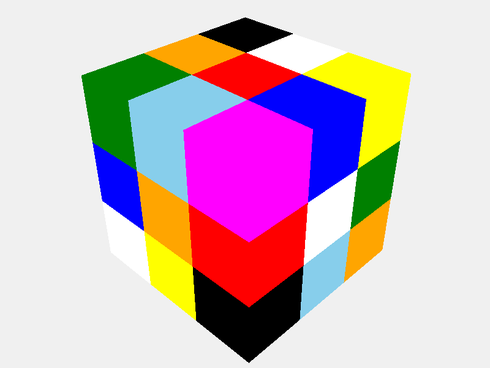

Here comes another toy puzzle I encountered recently:

> Can you arrange 27 cubes, each colored one of nine different colors (3 cubes of each color) into a 3×3×3 cube so that each face shows one square of each color?

As usual, these types of puzzles are fun because they can be solved in many different ways. For this one in particular, it becomes useful to visualize the cube in 3D, which can be done quite easily with [Three.js](//threejs.org).

## Solving it with code

The puzzle can surely be solved with an exact and deterministic method, involving recursion and heavy pruning. Or even by hand with a magic formula.

But when the number of combinations is high and we don't necessarily know how to start, it can be convenient to go with a more randomized approach, such as Genetic Algorithm, Simulated Annealing, Monte-Carlo Tree Search and so on.

Simulated annealing has the advantage to have a simple implementation (very little code), and it is the approach proposed in this post.

Here are the most important bits of the solver:

```js
const VALID = (1 << 9) - 1
const FACES = [
    0, 1, 2, 3, 4, 5, 6, 7, 8, // front
    0, 3, 6, 9, 12, 15, 18, 21, 24, // left
    0, 1, 2, 9, 10, 11, 18, 19, 20, // top
    2, 5, 8, 11, 14, 17, 20, 23, 26, // right
    18, 19, 20, 21, 22, 23, 24, 25, 26, // back
    6, 7, 8, 15, 16, 17, 24, 25, 26 // bottom
];

function rnd(a, b) {
    return Math.floor(a + Math.random() * (b - a));
}

function valid(fs, i) {
    let set = 0;
    for (let j = 0; j < 9; j++) {
        set |= (1 << fs[FACES[i * 9 + j]]);
    }
    return set === VALID;
}

function neighbor(permutation) {
    let copy = permutation.slice();
    let i = rnd(0, 27);
    let j = rnd(0, 27);
    let tmp = copy[i];
    copy[i] = copy[j];
    copy[j] = tmp;
    return copy;
}

function cost(permutation) {
    let score = 0;
    for (let i = 0; i < 6; i++) {
        if (!valid(permutation, i)) {
            score += 10;
        }
    }
    return score;
}

function solve_sa() {
    let start = performance.now();
    let solution = new Uint8Array(27).map((e, i) => i % 9);
    let currCost  = cost(solution);
    let temp = 1;
    let alpha = 0.9;
    let it = 0;
    while (currCost > 0) {
        let newSolution = neighbor(solution);
        let newCost = cost(newSolution);
        let diff = newCost - currCost;
        if (diff <= 0 || Math.exp(-diff / temp) > Math.random()) {
            solution = newSolution;
            currCost = newCost;
        }

        if (it % 500 === 0 && temp > 0.2) {
            temp *= alpha;
        }

        it++;
    }

    console.log('Found after', it, 'iterations');
    console.log('Elapsed:', Math.round(performance.now() - start), 'ms');

    return solution;
}
```

A few points:

- Cubes are defined by an integer between 0 and 26, and colors by an integer between 0 and 8
- The cost is evaluated based on the number of valid faces
- A face is valid if it contains the 9 colors
- From a current state of the cube, a new neighbor is created by swapping 2 cubes randomly chosen

With one caveat: Javascript's default `Math.random` function can't be seeded (it's a shame I know). To keep the code simple and limit the number of dependencies, I decided to use it anyway. So each page refresh might generate a different solution and can be slower or faster to converge.

The code is available as a gist: https://gist.github.com/jtpio/7d28871d961c7dc0aab161d2e329326c. The solver is wrapped within a Web Worker so it is executed asynchronously on the web page. Feel free to check it out by yourself by downloading it and running a simple web server (`python -m http.server` for instance, necessary for the Web Worker).

Here is a screenshot of one possible solution:



As always, there must be more than one approach to solve it. Let me know if you found a different one!

## Extra Challenge

Finding a solution for this puzzle wasn't too difficult, because the cubes can be arbitrarily placed on top of each other.

Apparently there exists a "physical" version of this puzzle, a la Rubik's Cube, as stated on the [Nine-Colour Cube Wikipedia page](https://en.wikipedia.org/wiki/Nine-Colour_Cube). The moves seem to be similar to the original Rubik's Cube (rotation of an entire face), which definitively makes it more challenging!


