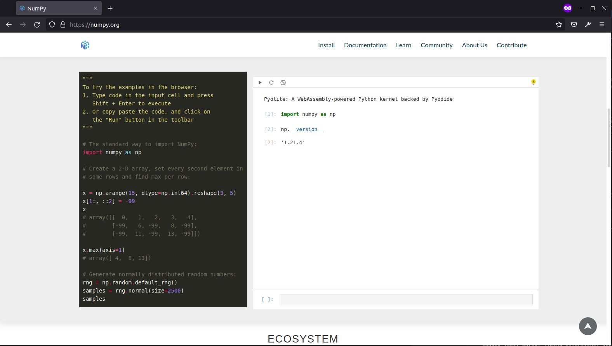

Long time no see!

For the past years I have been pretty busy contributing to open source projects within the Jupyter ecosystem on [GitHub](https://github.com/jtpio).

Most of my blog posts have then been published on the [Jupyter Blog on Medium](https://medium.com/@jeremy.tuloup).

Here is a quick update of one the most recent Jupyter projects.

## JupyterLite - Wasm powered Jupyter running in the browser 💡

One of the projects I have been busy with recently is (https://github.com/jupyterlite/jupyterlite).

JupyterLite is a JupyterLab distribution that runs entirely in the browser built from the ground-up using JupyterLab components and extensions.

<h1 style="text-align:center;">
  
</h1>

## The case for a standalone REPL

With JupyterLite you can create fully interactive static websites with the JupyterLab and RetroLab interfaces.

What makes it interesting is that you can also create custom applications with other JupyterLab widgets and extensions.

This gave the idea of creating a small and more minimal application to only expose a REPL to the users. The REPL can be easily embedded on existing websites.

This is for example the case on the [numpy.org](https://numpy.org) website, which now includes an interactive code console powered by JupyterLite to let users try NumPy in the browser:

## Try it

Since it is easy to embed, you can add the REPL to almost any website with an IFrame. For example in this post:

<iframe
  src="https://jtpio.github.io/lit/repl?toolbar=1&kernel=python&theme=JupyterLab Dark"
  width="100%"
  height="600px"
>
</iframe>

## References

Make sure to check out the JupyterLite documentation to learn how deploy your own website and start embedding REPLs!

https://jupyterlite.readthedocs.io
